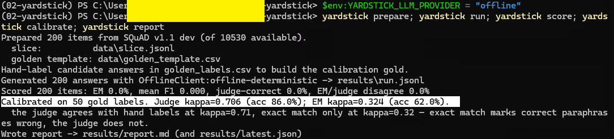
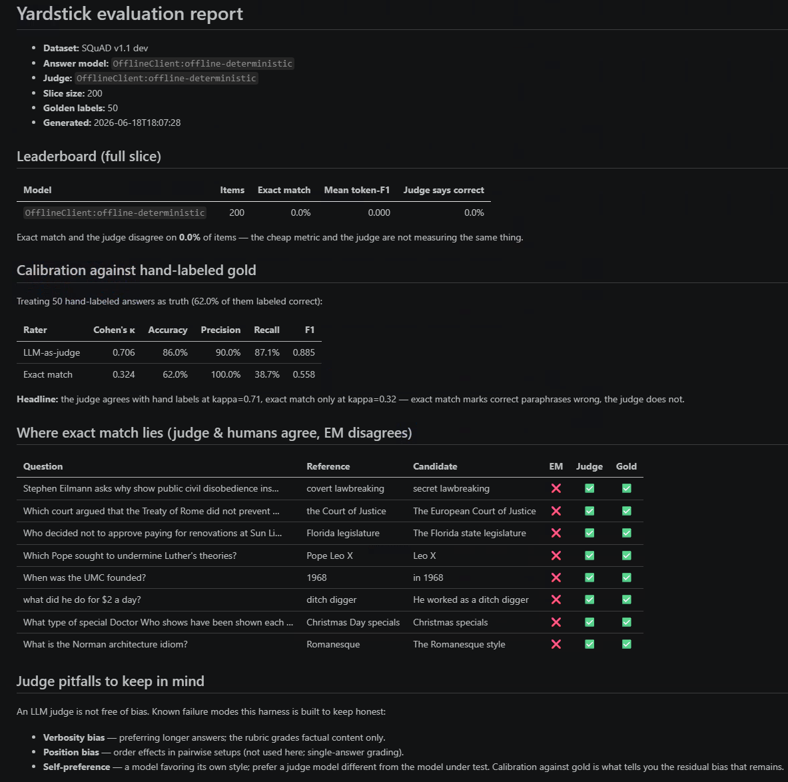

# Yardstick — calibrated LLM evaluation

A small, focused, end-to-end evaluation of an LLM on one task (short-answer factual QA). Yardstick scores
model answers two ways — a strict deterministic metric and an LLM-as-judge — then does the move most eval
demos skip: it **calibrates the judge against hand-labeled ground truth** and shows exactly where the
cheap string match lies to you.

## The headline (v0.1, on 50 hand-labeled SQuAD answers)

| Rater | Cohen's κ vs human gold | Accuracy | Precision | Recall |
|---|---:|---:|---:|---:|
| **LLM-as-judge** | **0.71** | 86% | 90% | 87% |
| Exact match | 0.32 | 62% | 100% | 39% |

Exact match never *wrongly accepts* an answer (precision 100%) but it *rejects 19 of 31 correct answers*
(recall 39%) — because it marks correct paraphrases wrong: `Leo X` for "Pope Leo X", `in 1968` for "1968",
`direction and magnitude` for "magnitude and direction". The judge tolerates paraphrase and tracks the
human labels more than twice as closely (κ 0.71 vs 0.32). **That gap, measured rather than assumed, is the
product.** And because we measured it, we can also see where the judge itself is wrong (3 false accepts on
shuffled/reversed facts, 4 misses on numeral/synonym paraphrases) — which is the whole reason you calibrate
before you trust a judge.

## What it looks like

The whole pipeline runs end to end with the offline backend, so it reproduces with no API key:



The calibration report it generates — the judge-vs-gold agreement table and the "where exact match lies"
examples:



## Why it's not a prompt wrapper

Remove the LLMs and there is still real software: dataset tooling, SQuAD-style normalized exact-match and
token-F1 metrics, Cohen's-kappa agreement statistics, a confusion-matrix calibration report, and a markdown
report generator — all pure-Python and unit-tested. The AI usage here, the judge, is *itself evaluated*
(calibrated against gold). The project's whole subject is making AI measurable.

## Pipeline

```bash
uv venv && uv pip install -e ".[dev,anthropic]"

yardstick prepare      # download + slice SQuAD v1.1 dev (~200 Q&A) + a golden-label template
                       # (hand-label ~50 rows -> data/golden_labels.csv; one is committed already)
yardstick run          # generate model answers for the slice (provider-agnostic; responses cached)
yardstick score        # normalized exact-match + token-F1 + LLM-judge verdict for every item
yardstick calibrate    # judge-vs-gold and EM-vs-gold agreement (accuracy, precision/recall, Cohen's κ)
yardstick report       # markdown report -> results/report.md (+ results/latest.json)
```

Each stage reads/writes plain files under `data/` and `results/`, so the steps compose and a run is
reproducible.

## Provider-agnostic by design

The LLM sits behind one `LLMClient.complete(messages, schema)` contract; no vendor SDK is imported outside
its adapter. Select the backend with `YARDSTICK_LLM_PROVIDER` (`auto` default → Anthropic if
`ANTHROPIC_API_KEY` is set, else OpenAI if `OPENAI_API_KEY` is set, else `offline`).

The **offline client is a real baseline, not a stub that peeks at the answer**:
- as an *answerer* it sees only the question and returns a knowledge-free guess, so an offline leaderboard
  is honestly weak (plug in a real provider for a real leaderboard);
- as a *judge* it decides correctness from the token-F1 overlap of candidate vs reference (threshold 0.5)
  — a defensible heuristic that genuinely tolerates paraphrase better than strict exact match. **The
  headline above was produced entirely offline**, so it reproduces with no API key and no network; with a
  key, the real LLM judge replaces the heuristic and the same harness calibrates *that* judge instead.

## Judge pitfalls (called out, not ignored)

An LLM judge has known biases — verbosity bias (preferring longer answers), position bias (order effects in
pairwise setups), and self-preference (favoring its own style; prefer a judge model different from the model
on trial). The rubric grades factual content only, and calibration against gold is what quantifies the
residual bias that remains.

## Layout

```
yardstick/
  cli.py        # prepare | run | score | calibrate | report
  llm.py        # provider-agnostic client (Anthropic/OpenAI adapters + offline) + disk cache
  data.py       # SQuAD download/slice + golden-label CSV IO
  metrics.py    # normalized exact match, token-F1, Cohen's kappa (pure, unit-tested)
  judge.py      # LLM-as-judge: rubric + JSON-schema structured verdict
  calibrate.py  # judge-vs-gold & EM-vs-gold agreement stats
  report.py     # markdown report
data/           # gitignored bulk; data/README.md + data/golden_labels.csv are committed
results/        # run outputs (gitignored; report.md, latest.json, ...)
assets/         # committed screenshots used in this README
tests/          # 29 tests; ruff + black clean
```

## License

MIT. Public, unrestricted libraries and public datasets only (SQuAD v1.1, CC BY-SA 4.0).
